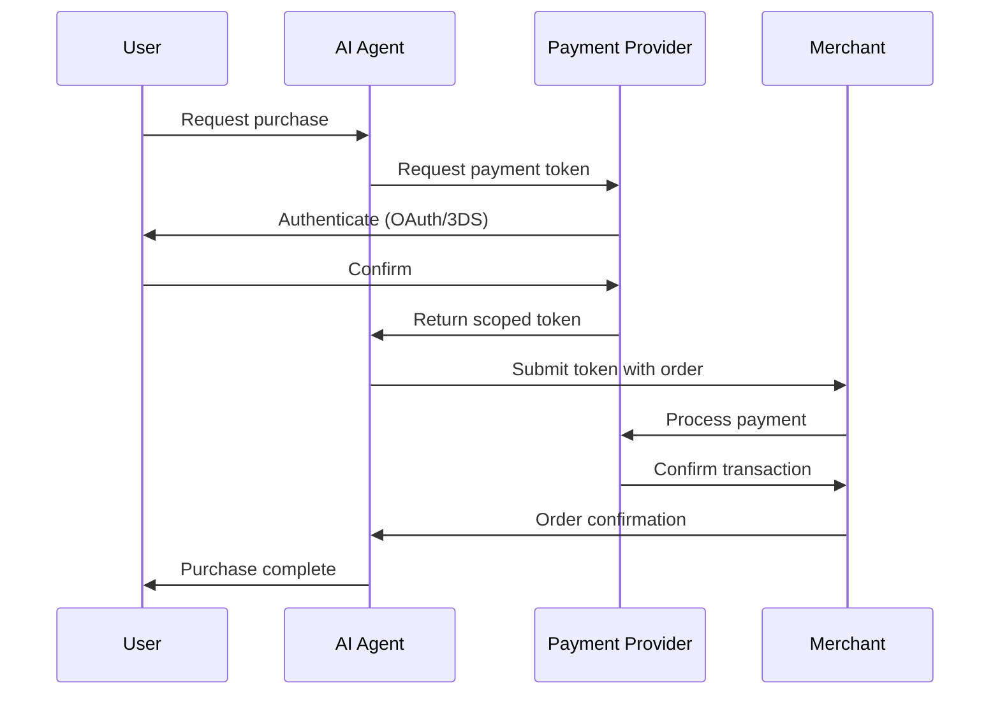

# Payment Integration for AI Workflow Automation

## Research Documentation - January 2026

This document provides comprehensive guidance on integrating payment capabilities into AI workflow automation systems, covering payment providers, booking APIs, security considerations, and implementation approaches.

---

## Table of Contents

1. [Payment Providers](#1-payment-providers)
   - [Stripe](#stripe)
   - [Apple Pay / Google Pay](#apple-pay--google-pay)
   - [PayPal](#paypal)
2. [Booking/Purchase Flows](#2-bookingpurchase-flows)
3. [Third-Party Booking APIs](#3-third-party-booking-apis)
4. [Security Considerations](#4-security-considerations)
5. [Implementation Approach](#5-implementation-approach)
6. [Code Samples](#6-code-samples)
7. [API Documentation Links](#7-api-documentation-links)

---

## 1. Payment Providers

### Stripe

Stripe offers the most comprehensive solution for AI agent payment integration through its **Agentic Commerce Suite**.

#### Stripe Agent Toolkit

The Stripe Agent Toolkit enables integration with popular AI frameworks:
- **OpenAI Agents SDK** (Python)
- **Vercel AI SDK** (Node.js)
- **LangChain** (Python and Node.js)
- **CrewAI** (Python)

**Key Features:**
- Native billing by prompt and completion token usage
- Works with any LLM provider supporting function calling
- Compatible with Python and TypeScript

#### Shared Payment Tokens (SPT)

Stripe's **Shared Payment Tokens (SPTs)** are designed specifically for agentic commerce:

```
Key Properties:
- Scoped to a specific business
- Limited by time and amount
- Can be revoked at any time
- Monitored via webhook events
- Single-transaction use for security
```

**How SPT Works:**
1. Buyer creates or reuses a saved payment method with the AI platform
2. Buyer clicks "Buy" - AI platform issues SPT scoped to the business
3. SPT includes usage limit tied to checkout total
4. AI platform sends SPT identifier to business via API
5. Business uses SPT to create a PaymentIntent
6. Stripe clones the original PaymentMethod when confirming

**Fraud Protection:**
SPTs are powered by Stripe Radar and relay risk signals including:
- Likelihood of fraudulent dispute
- Card testing detection
- Stolen card signals
- Card issuer decline predictions

#### Stripe Workflows (Announced May 2025)

Zero-code automation for Stripe operations:
- Chain together actions via Stripe API
- Run in response to events
- Over 600 Stripe actions available
- Conditional logic for fraud checks, invoice approvals, compliance

#### Agentic Commerce Protocol (ACP)

Stripe's ACP enables AI agents to:
- Reason, plan, and respond with purchasing power
- Facilitate direct buyer-merchant transactions
- Work with partners: Microsoft Copilot, Anthropic, Perplexity, Vercel, Lovable, Replit, Bolt, Manus

**Supported Merchants:**
Coach, Kate Spade, URBN (Anthropologie, Free People, Urban Outfitters), Revolve, Ashley Furniture, and platforms like Squarespace, Wix, Etsy, WooCommerce, commercetools, BigCommerce.

---

### Apple Pay / Google Pay

Both services use **payment network tokenization** for security.

#### Google Pay Integration

**Authorization Methods:**
- `PAN_ONLY`: Receive personal account numbers from Google Pay
- `CRYPTOGRAM_3DS`: Receive network tokens and cryptograms

**Integration Requirements:**
1. Review terms and select supported processor
2. Adhere to brand guidelines
3. Complete tutorial and checklist
4. Request production access via Google Pay & Wallet Console

**Direct Integration Note:** Only available to merchants who are PCI DSS compliant, validated by a Qualified Security Assessor.

**Testing:** Google Pay doesn't provide test cards - use "live" cards in sandbox environment with production tokens.

#### Apple Pay Integration

**Requirements:**
1. Create an Apple merchant ID
2. Generate Certificate Signing Request (CSR)
3. Implement payment network tokenization

**Supported Networks:** Mastercard, Visa, Amex, Discover (all receive liability shift)

**Testing:** Use Apple Pay sandbox environment for transaction testing.

#### SDK Approach (Authorize.net)

```javascript
// Example: Accept Mobile SDK flow
// 1. Use SDK to dispatch payment data
// 2. Receive secure payment nonce (one-time-use token)
// 3. Use nonce in place of card data in API calls
```

---

### PayPal

#### REST API Overview

**Authentication:**
- Uses client ID and client secret
- Exchange credentials for access token

```bash
# Get access token
curl -X POST https://api-m.paypal.com/v1/oauth2/token \
  -u "CLIENT_ID:CLIENT_SECRET" \
  -H "Content-Type: application/x-www-form-urlencoded" \
  -d "grant_type=client_credentials"
```

**Basic Checkout Flow:**
1. Buyer selects PayPal button on merchant's site
2. Merchant calls Create Order API with product details
3. API returns order ID, approval URL, and return URL
4. Buyer chooses payment method and approves order
5. Buyer redirected to return URL
6. Merchant calls Capture Payment for Order endpoint

#### OpenAI Partnership (October 2025)

PayPal adopted the Agentic Commerce Protocol (ACP) for ChatGPT integration:
- Millions of ChatGPT users can checkout instantly using PayPal
- PayPal supports payments processing for OpenAI Instant Checkout

**Important:** The `/v1/payments` endpoint is deprecated. Use `/v2/payments` instead.

---

## 2. Booking/Purchase Flows

### Secure Payment Handling on Behalf of Users

#### Token-Based Payment Methods

**Best Practices:**
1. Never store raw card data - use tokenization
2. Use payment processor-provided tokens (Stripe PaymentMethod, PayPal vault)
3. Implement scoped tokens with time and amount limits
4. Use single-use tokens where possible

**Stripe Token Flow:**
```python
# Create a PaymentIntent with saved payment method
stripe.PaymentIntent.create(
    amount=1000,
    currency="usd",
    customer="cus_xxx",
    payment_method="pm_xxx",
    confirm=True,
    off_session=True
)
```

### PCI Compliance Considerations

#### Key Requirements for AI Agents

Per PCI Security Standards Council guidance:

1. **Use payment tokens or single-use PANs** to limit scope and impact
2. **Requirement 3**: Secure cardholder data at rest
3. **Requirement 4**: Secure data during transmission
4. **Apply equally to AI-based systems**

**Tokenization Approach:**
```
Best Practice: Never let card data touch your systems
- AI agent requests token from payment processor
- Token passed to business for processing
- No cardholder data in agent memory or logs
```

#### AI-Specific Risks

- Agentic AI can mimic legitimate user flows with sophistication
- Cardholder data environments (CDEs) more vulnerable without API protection
- Organizations must document agent privileges and validate AI outputs

**Mitigation Strategies:**
- Redirect users to PCI-compliant hosted payment pages
- Use HTTPS with TLS encryption
- Avoid embedding payment fields directly in chatbot interfaces
- Implement secure payment solutions that separate AI from payment data

---

## 3. Third-Party Booking APIs

### Flight Booking

#### Amadeus APIs

**API Tiers:**

| Type | Features | Requirements |
|------|----------|--------------|
| Self-Service | REST/JSON, pay-as-you-go, sandbox access | Developer account |
| Enterprise | Full GDS access, SOAP + REST, direct ticketing | IATA/ARC certification |

**Key APIs:**
- Flight Offers Search
- Flight Offers Price
- Flight Create Orders
- SeatMap Display

**Authentication:** OAuth 2.0

**Pricing:**
- Free monthly quotas
- Per-call charges: €0.001 to €0.025 when exceeding quotas

**Production Access:**
- Fill form with business and application details
- Choose payment method (credit card or bank transfer)
- Sign Terms of Service via DocuSign
- Validation: up to 72 hours for first app

**Documentation:** https://developers.amadeus.com/

#### Skyscanner API

**Endpoints:**
```
POST /apiservices/v3/flights/live/search/create
POST /apiservices/v3/flights/live/search/poll/{sessionToken}
```

**Features:**
- Real-time pricing from 1,200+ airline partners
- Free tier for testing
- Pay-per-use and subscription pricing options

**Available APIs:**
- Flights Live Prices API
- Flights Indicative Prices API
- Car Hire APIs
- Geo API (airports, cities, countries)

**Documentation:** https://developers.skyscanner.net/docs/intro

---

### Hotel Booking

#### Booking.com Demand API

**Access Requirements:**
- Become an approved affiliate or connectivity partner
- No charge for API access
- Partnership application required

**API V3 Features:**
- All travel products in one API
- Accommodations, attractions, car rentals, flights, taxis
- RESTful API with JSON responses
- HTTPS POST requests

**Capabilities:**
- Search, retrieve details, check availability
- Manage bookings and run reports
- Authentication using Affiliate ID and token credentials

**Documentation:** https://developers.booking.com/demand

#### Hotels.com / Expedia

Access through Expedia Affiliate Network (EAN) or Expedia Partner Solutions (separate from Booking.com).

---

### Restaurant Reservations

#### OpenTable API

**Access Requirements:**
1. Apply as affiliate partner
2. Wait for approval
3. Receive credentials for reservation links
4. Integrate in pre-production environment
5. Submit for QA testing before production

**Features:**
- Real-time reservations sync
- Guest info and order details
- Personalized offers and loyalty rewards

**Technical Details:**
- RESTful API with JSON responses
- OAuth-based authentication
- API Sandbox for testing

**Contact:** busdev@opentable.com

**Documentation:**
- https://docs.opentable.com/
- https://dev.opentable.com/

---

### Event Tickets

#### Ticketmaster API

**APIs:**
- **Discovery API**: Search events, attractions, venues
- **Partner API**: Reserve, purchase, retrieve tickets

**Authentication:**
- API key provided by Ticketmaster
- Send as query parameter `apikey` or header `x-api-key`

**Rate Limits:**
- Default: 5,000 API calls/day, 5 requests/second
- Increases available on case-by-case basis

**Content Sources:**
- Ticketmaster, Universe, FrontGate Tickets, Ticketmaster Resale (TMR)

**Documentation:** https://developer.ticketmaster.com/

#### Eventbrite API

**Features:**
- Event creation, ticketing, attendee management
- Multiple ticket types, pricing tiers, discounts
- Secure checkout with multiple payment methods
- Analytics dashboard

**Best For:** Small to medium-sized events, community-driven events

**Documentation:** https://www.eventbrite.com/platform/api

---

## 4. Security Considerations

### Storing Payment Credentials Safely

**Never Store:**
- Full card numbers (PAN)
- CVV/CVC codes
- Full magnetic stripe data

**Recommended Approach:**
1. Use processor-provided tokens
2. Store only token references
3. Implement encryption at rest for any sensitive data
4. Use secrets management (AWS Secrets Manager, HashiCorp Vault)

### Authorization Flows

**For AI Agents:**



### Fraud Prevention

**Stripe Radar Integration:**
- Automatic risk scoring for SPT transactions
- Detection of fraudulent disputes
- Card testing prevention
- Stolen card identification

**Best Practices:**
1. Implement velocity checks
2. Monitor for unusual patterns
3. Use 3D Secure for authentication
4. Validate user intent before processing
5. Log all agent actions for audit

---

## 5. Implementation Approach

### Using Composio/Rube MCP for OAuth Flows

Composio offers 500+ pre-built integrations including Stripe:

**Setup:**
```bash
npx @composio/cli add cursor --app stripe
```

**Capabilities via Composio:**
- Create Stripe PaymentIntents
- Manage subscriptions
- Create refunds
- Handle connected accounts

**OAuth Handling:**
- Set up OAuth once
- Automatic token management
- No manual token refresh needed

**MCP OAuth 2.1 Standards:**
- PKCE protection for authorization code exchanges
- Standard metadata sharing (RFC 8414)

### Direct API Integrations

**When to Use:**
- Need full control over payment flow
- Complex custom requirements
- High-volume transaction processing

**Implementation Steps:**
1. Register for API credentials
2. Implement OAuth 2.0 / API key authentication
3. Handle token refresh automatically
4. Implement webhook handlers for async events
5. Add error handling and retry logic

### Browser Automation as Fallback

**Use Cases:**
- APIs not available or limited
- Legacy systems without API access
- Complex multi-step booking processes

**Tools:**
- Playwright (via MCP)
- Puppeteer
- Selenium

**Considerations:**
- More fragile than API integration
- Requires maintenance as UIs change
- May violate Terms of Service
- Slower than direct API calls

**Best Practice:** Use browser automation only as last resort when APIs are not available.

---

## 6. Code Samples

### Stripe Payment Intent with Agent Toolkit

```python
# Python - Using Stripe Agent Toolkit with OpenAI
from stripe_agent_toolkit import StripeAgentToolkit
from openai import OpenAI

toolkit = StripeAgentToolkit(
    secret_key="sk_test_xxx",
    configuration={
        "actions": {
            "payment_links": {"create": True},
            "products": {"create": True},
            "prices": {"create": True}
        }
    }
)

client = OpenAI()

# Agent creates payment link dynamically
response = client.chat.completions.create(
    model="gpt-4",
    messages=[{"role": "user", "content": "Create a payment link for $50"}],
    tools=toolkit.get_tools()
)
```

### Stripe Shared Payment Token Usage

```python
import stripe

# Business receives SPT from AI platform
spt_id = "spt_xxx"

# Create PaymentIntent using SPT
payment_intent = stripe.PaymentIntent.create(
    amount=2000,
    currency="usd",
    payment_method=spt_id,
    confirm=True,
    # SPT automatically clones the underlying PaymentMethod
)
```

### PayPal Order Creation

```python
import requests
import base64

# Get access token
client_id = "YOUR_CLIENT_ID"
client_secret = "YOUR_CLIENT_SECRET"
credentials = base64.b64encode(f"{client_id}:{client_secret}".encode()).decode()

token_response = requests.post(
    "https://api-m.paypal.com/v1/oauth2/token",
    headers={
        "Authorization": f"Basic {credentials}",
        "Content-Type": "application/x-www-form-urlencoded"
    },
    data="grant_type=client_credentials"
)
access_token = token_response.json()["access_token"]

# Create order
order = requests.post(
    "https://api-m.paypal.com/v2/checkout/orders",
    headers={
        "Authorization": f"Bearer {access_token}",
        "Content-Type": "application/json"
    },
    json={
        "intent": "CAPTURE",
        "purchase_units": [{
            "amount": {
                "currency_code": "USD",
                "value": "100.00"
            }
        }]
    }
)
```

### Amadeus Flight Search

```python
from amadeus import Client, ResponseError

amadeus = Client(
    client_id='YOUR_API_KEY',
    client_secret='YOUR_API_SECRET'
)

try:
    # Search for flights
    response = amadeus.shopping.flight_offers_search.get(
        originLocationCode='NYC',
        destinationLocationCode='LAX',
        departureDate='2026-03-01',
        adults=1
    )

    # Get first offer details
    offer = response.data[0]
    print(f"Price: {offer['price']['total']} {offer['price']['currency']}")

except ResponseError as error:
    print(error)
```

### Skyscanner Flight Search

```python
import requests

api_key = "YOUR_SKYSCANNER_API_KEY"

# Create search session
response = requests.post(
    "https://partners.api.skyscanner.net/apiservices/v3/flights/live/search/create",
    headers={
        "x-api-key": api_key,
        "Content-Type": "application/json"
    },
    json={
        "query": {
            "market": "US",
            "locale": "en-US",
            "currency": "USD",
            "queryLegs": [{
                "originPlaceId": {"iata": "JFK"},
                "destinationPlaceId": {"iata": "LAX"},
                "date": {"year": 2026, "month": 3, "day": 1}
            }],
            "cabinClass": "CABIN_CLASS_ECONOMY",
            "adults": 1
        }
    }
)

session_token = response.json()["sessionToken"]

# Poll for results
results = requests.post(
    f"https://partners.api.skyscanner.net/apiservices/v3/flights/live/search/poll/{session_token}",
    headers={"x-api-key": api_key}
)
```

### Composio MCP Integration

```python
# Using Composio for OAuth-managed Stripe calls
from composio import ComposioToolSet, App

toolset = ComposioToolSet()

# Get Stripe tools
stripe_tools = toolset.get_tools(apps=[App.STRIPE])

# Execute payment intent creation
result = toolset.execute_action(
    action="STRIPE_CREATE_PAYMENT_INTENT",
    params={
        "amount": 5000,
        "currency": "usd",
        "payment_method_types": ["card"]
    }
)
```

---

## 7. API Documentation Links

### Payment Providers

| Provider | Documentation URL |
|----------|------------------|
| Stripe Agentic Commerce | https://docs.stripe.com/agentic-commerce |
| Stripe Agent Toolkit | https://docs.stripe.com/agents |
| Stripe MCP | https://docs.stripe.com/mcp |
| PayPal REST APIs | https://developer.paypal.com/api/rest/ |
| PayPal Orders API | https://developer.paypal.com/docs/api/orders/v2/ |
| Google Pay API | https://developers.google.com/pay/api |
| Apple Pay | https://developer.apple.com/apple-pay/ |

### Travel & Booking

| Provider | Documentation URL |
|----------|------------------|
| Amadeus Flight APIs | https://developers.amadeus.com/self-service/category/flights |
| Amadeus Documentation | https://developers.amadeus.com/ |
| Skyscanner API | https://developers.skyscanner.net/docs/intro |
| Skyscanner Partners | https://www.partners.skyscanner.net/product/travel-api |
| Booking.com Demand API | https://developers.booking.com/demand |
| Booking.com Partnerships | https://partnerships.booking.com/api-v3 |

### Reservations & Tickets

| Provider | Documentation URL |
|----------|------------------|
| OpenTable API | https://docs.opentable.com/ |
| OpenTable Partner Portal | https://dev.opentable.com/ |
| Ticketmaster Discovery API | https://developer.ticketmaster.com/products-and-docs/apis/discovery-api/v2/ |
| Ticketmaster Partner API | https://developer.ticketmaster.com/products-and-docs/apis/partner/ |
| Eventbrite API | https://www.eventbrite.com/platform/api |

### Integration Platforms

| Platform | Documentation URL |
|----------|------------------|
| Composio MCP Stripe | https://mcp.composio.dev/stripe |
| Composio OAuth 2.1 Guide | https://composio.dev/blog/oauth-2-1-in-mcp |
| Stripe GitHub AI Repo | https://github.com/stripe/ai |

---

## Summary Recommendations

### For General Payments
**Use Stripe's Agentic Commerce Suite** - most mature solution for AI agent payments with SPT for secure token handling.

### For Travel Booking
- **Flights**: Amadeus Self-Service APIs (easiest) or Skyscanner for meta-search
- **Hotels**: Booking.com Demand API through affiliate program
- **Restaurants**: OpenTable API (requires partnership)
- **Events**: Ticketmaster Discovery + Partner APIs

### For Security
1. Never store raw payment credentials
2. Use scoped, time-limited tokens
3. Redirect to PCI-compliant payment pages
4. Implement 3D Secure authentication
5. Log all agent payment actions

### For Implementation
1. Start with Composio/Rube MCP for OAuth management
2. Use direct APIs for high-volume or custom needs
3. Reserve browser automation for last resort

---

## Sources

- [Stripe Agentic Commerce Blog](https://stripe.com/blog/introducing-our-agentic-commerce-solutions)
- [Stripe Shared Payment Tokens Documentation](https://docs.stripe.com/agentic-commerce/concepts/shared-payment-tokens)
- [Stripe Agent Toolkit Documentation](https://docs.stripe.com/agents)
- [PCI SSC AI Principles](https://blog.pcisecuritystandards.org/ai-principles-securing-the-use-of-ai-in-payment-environments)
- [Amadeus for Developers](https://developers.amadeus.com/)
- [Skyscanner Developer Documentation](https://developers.skyscanner.net/docs/intro)
- [Booking.com Developer Portal](https://developers.booking.com/)
- [OpenTable API Documentation](https://docs.opentable.com/)
- [Ticketmaster Developer Portal](https://developer.ticketmaster.com/)
- [Eventbrite Platform API](https://www.eventbrite.com/platform/api)
- [PayPal Developer Documentation](https://developer.paypal.com/api/rest/)
- [Google Pay API Overview](https://developers.google.com/pay/api/web/overview)
- [Composio MCP Stripe Integration](https://mcp.composio.dev/stripe)
